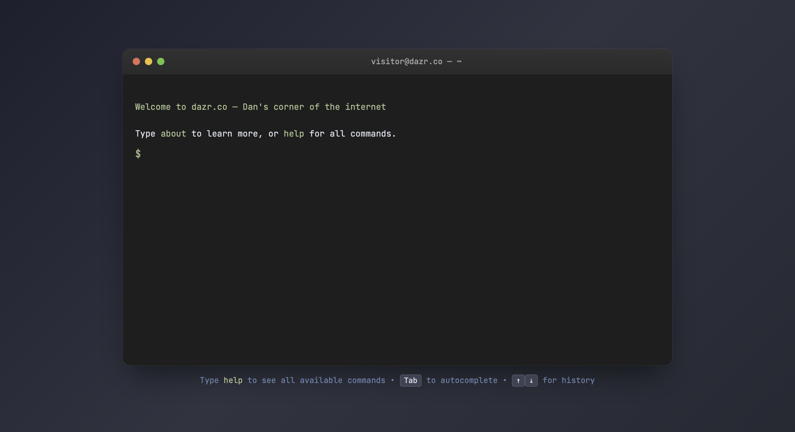

# 🖥️ Terminal Portfolio

A minimal, modern, interactive terminal-style personal website. Built with vanilla HTML, CSS, and JavaScript.



## ✨ Features

- **Terminal interface** — macOS-style window with authentic UX
- **Interactive commands** — `help`, `about`, `projects`, `skills`, `contact`, `whoami`, and more
- **Contact form** — Built-in message form (no email exposed to bots)
- **Keyboard shortcuts** — Tab autocomplete, arrow history, Ctrl+C cancellation
- **Responsive** — Works on desktop and mobile
- **Zero dependencies** — Just one HTML file

## 🚀 Quick Start

### 1. Fork or Download
Fork this repo or download `index.html`

### 2. Find the CONFIG
Open `index.html` and scroll to **line ~280** until you see:

```javascript
const CONFIG = {
    // ─── Personal Info ───
    name: 'Dan',
    domain: 'dazr.co',
    // ... etc
};
```

### 3. Customize
Edit the CONFIG values:

| Field | What It Does | Example |
|-------|--------------|---------|
| `name` | Your name shown in commands | `'Dan'` |
| `domain` | Your website domain | `'dazr.co'` |
| `web3formsKey` | Your Web3Forms access key | `'abc123...'` |
| `aboutText` | Your bio (supports newlines) | `'Hi, I'm...'` |
| `skills` | Array of skill categories | `[{category, items}]` |
| `projects` | Array of projects | `[{name, desc, tech}]` |
| `showDisclaimer` | Show "self-taught" disclaimer | `true` or `false` |

### 4. Get Web3Forms Key (Free)
1. Go to [web3forms.com](https://web3forms.com/)
2. Enter your email address
3. Copy the access key
4. Paste into `CONFIG.web3formsKey`

### 5. Test Locally
Double-click `index.html` to open in browser. Test all commands work.

### 6. Deploy

#### GitHub Pages (Free)
1. Push to GitHub
2. Go to Settings → Pages
3. Source: Deploy from a branch → `main`
4. Your site is live at `https://yourusername.github.io/repo-name/`

#### Other Hosts
Upload `index.html` to any static host (Netlify, Vercel, Fastmail, etc.)

## 📝 Customization Guide

### Change Colors
Edit the CSS variables in the `<style>` section:

```css
/* Nord theme colors used by default */
--nord-green: #a3be8c;
--nord-blue: #81a1c1;
--nord-red: #bf616a;
```

### Add/Remove Commands
The commands are defined in the `commands` object (around line 335). Each command has:
- `description` — shown in `help`
- `execute()` — function returning HTML string

To hide commands without deleting code, add them to a `hiddenCommands` array in CONFIG (feature coming soon).

### Modify About Section
Edit `CONFIG.aboutText`:

```javascript
aboutText: `Your text here.

Multiple paragraphs work.

Just use backticks for multi-line strings.`,
```

### Update Projects
Edit the `CONFIG.projects` array:

```javascript
projects: [
    { name: 'Project Name', desc: 'What it does', tech: 'HTML, CSS' },
    // Add more...
],
```

## 🔒 About Web3Forms Security

**Is my Web3Forms key safe in the code?**

Web3Forms access keys are **designed to be public** — they function like form endpoint addresses, not passwords. Think of them like a postal address: anyone can see it, but only the intended recipient (you) receives the messages.

- ✅ Keys cannot be used to access your account
- ✅ Keys cannot read your emails
- ✅ Keys can only submit forms to your address
- ✅ If spam becomes an issue, regenerate the key at web3forms.com

For extra protection, Web3Forms includes spam filtering and you can add a honeypot field.

## 🐛 Troubleshooting

### Commands not working?
- Check browser console (F12) for JavaScript errors
- Ensure CONFIG values don't have syntax errors (missing quotes, commas)

### Contact form not sending?
- Verify `CONFIG.web3formsKey` is correct
- Check Web3Forms dashboard for submissions
- Check spam folder

### Looks wrong on mobile?
- CSS media queries handle this automatically
- Try refreshing or clearing cache

## 📄 License

MIT License — do whatever you want. Attribution appreciated but not required.

## 🙏 Credits

- Built with AI. Prompted and curated by [Dan](https://dazr.co)
- Inspired by macOS Terminal
- Colors from [Nord Theme](https://www.nordtheme.com/)
- Font: JetBrains Mono

---

**Questions?** Open an issue or send a message via the contact form on the demo site.
